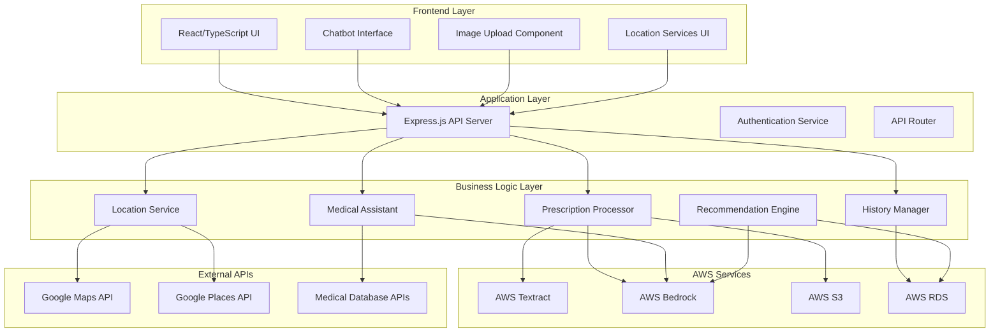

# Design Document: Medical Assistant System

## Overview

The Medical Assistant System is a comprehensive healthcare application that combines AI-powered prescription processing with intelligent medical guidance and location-based services. Built on React/TypeScript frontend with AWS cloud services, the system processes prescription images using AWS Textract, leverages AWS Bedrock for intelligent text analysis, and provides personalized medication recommendations based on user history.

The system architecture follows a modular approach with clear separation between prescription processing, medical history management, AI-powered recommendations, and location services. This design ensures scalability, maintainability, and compliance with healthcare data privacy requirements.

## Architecture

### High-Level Architecture



### Component Architecture

The system is organized into distinct layers with clear responsibilities:

1. **Frontend Layer**: React/TypeScript components for user interaction
2. **Application Layer**: Express.js server handling API requests and routing
3. **Business Logic Layer**: Core services implementing medical assistant functionality
4. **Data Layer**: AWS services and external APIs for data processing and storage

## Components and Interfaces

### Frontend Components

#### PrescriptionUpload Component
- **Purpose**: Handle prescription image uploads with drag-and-drop interface
- **Key Features**: Image preview, format validation, upload progress tracking
- **Integration**: Connects to Prescription Processor API endpoints
- **File Location**: `src/components/upload/PrescriptionUpload.tsx`

#### MedicalChatbot Component
- **Purpose**: Conversational interface for medical queries and guidance
- **Key Features**: Natural language processing, context awareness, medical disclaimers
- **Integration**: Connects to Medical Assistant API and History Manager
- **File Location**: `src/components/AdvancedChatbot.tsx` (extend existing)

#### LocationServices Component
- **Purpose**: Display nearby pharmacies and hospitals with interactive maps
- **Key Features**: Geolocation integration, filtering by distance, contact information
- **Integration**: Google Maps API and Places API
- **File Location**: `src/components/LocationServices.tsx`

#### MedicationHistory Component
- **Purpose**: Display user's medication timeline and patterns
- **Key Features**: Chronological view, medication details, adherence tracking
- **Integration**: History Manager API
- **File Location**: `src/components/dashboard/MedicationHistory.tsx`

### Backend Services

#### Prescription Processor Service
```typescript
interface PrescriptionProcessor {
  processImage(imageBuffer: Buffer, userId: string): Promise<ProcessedPrescription>
  extractText(imageBuffer: Buffer): Promise<ExtractedText>
  structureData(rawText: string): Promise<MedicationData[]>
  validateMedications(medications: MedicationData[]): Promise<ValidationResult>
}

interface ProcessedPrescription {
  id: string
  userId: string
  medications: MedicationData[]
  extractedText: string
  confidence: number
  processedAt: Date
}
```

#### History Manager Service
```typescript
interface HistoryManager {
  storePrescription(prescription: ProcessedPrescription): Promise<void>
  getUserHistory(userId: string): Promise<MedicationHistory>
  analyzePatterns(userId: string): Promise<MedicationPatterns>
  getAdherenceData(userId: string): Promise<AdherenceMetrics>
}

interface MedicationHistory {
  userId: string
  prescriptions: ProcessedPrescription[]
  totalMedications: number
  dateRange: DateRange
  patterns: MedicationPatterns
}
```

#### Medical Assistant Service
```typescript
interface MedicalAssistant {
  generateRecommendations(userId: string, context: string): Promise<Recommendation[]>
  answerQuery(query: string, userHistory: MedicationHistory): Promise<ChatResponse>
  checkInteractions(medications: MedicationData[]): Promise<InteractionWarning[]>
  provideMedicationInfo(medicationName: string): Promise<MedicationInfo>
}

interface Recommendation {
  type: 'medication' | 'lifestyle' | 'consultation'
  title: string
  description: string
  priority: 'low' | 'medium' | 'high'
  reasoning: string
  sources: string[]
}
```

#### Location Service
```typescript
interface LocationService {
  findNearbyPharmacies(location: Coordinates, radius: number): Promise<Pharmacy[]>
  findNearbyHospitals(location: Coordinates, radius: number): Promise<Hospital[]>
  getLocationFromAddress(address: string): Promise<Coordinates>
  calculateDistance(from: Coordinates, to: Coordinates): number
}

interface MedicalFacility {
  id: string
  name: string
  address: string
  coordinates: Coordinates
  phone: string
  hours: OperatingHours
  distance: number
  rating: number
}
```

## Data Models

### Core Data Structures

#### User Profile
```typescript
interface UserProfile {
  id: string
  email: string
  firstName: string
  lastName: string
  dateOfBirth: Date
  allergies: string[]
  chronicConditions: string[]
  emergencyContact: EmergencyContact
  preferences: UserPreferences
  createdAt: Date
  updatedAt: Date
}
```

#### Medication Data
```typescript
interface MedicationData {
  name: string
  genericName: string
  dosage: string
  frequency: string
  duration: string
  instructions: string
  prescribedBy: string
  prescriptionDate: Date
  refills: number
  ndc: string // National Drug Code
  confidence: number
}
```

#### Medical History Entry
```typescript
interface MedicalHistoryEntry {
  id: string
  userId: string
  prescriptionId: string
  medications: MedicationData[]
  symptoms: string[]
  diagnosis: string
  prescribingPhysician: string
  facilityName: string
  visitDate: Date
  notes: string
  attachments: string[]
}
```

### Database Schema

#### Prescriptions Table
- `id` (UUID, Primary Key)
- `user_id` (UUID, Foreign Key)
- `original_image_url` (VARCHAR)
- `extracted_text` (TEXT)
- `processed_data` (JSONB)
- `confidence_score` (DECIMAL)
- `status` (ENUM: processing, completed, failed)
- `created_at` (TIMESTAMP)
- `updated_at` (TIMESTAMP)

#### Medications Table
- `id` (UUID, Primary Key)
- `prescription_id` (UUID, Foreign Key)
- `name` (VARCHAR)
- `generic_name` (VARCHAR)
- `dosage` (VARCHAR)
- `frequency` (VARCHAR)
- `duration` (VARCHAR)
- `ndc_code` (VARCHAR)
- `created_at` (TIMESTAMP)

#### User_Medical_History Table
- `id` (UUID, Primary Key)
- `user_id` (UUID, Foreign Key)
- `prescription_id` (UUID, Foreign Key)
- `visit_date` (DATE)
- `diagnosis` (TEXT)
- `prescribing_physician` (VARCHAR)
- `facility_name` (VARCHAR)
- `notes` (TEXT)
- `created_at` (TIMESTAMP)

## Correctness Properties

*A property is a characteristic or behavior that should hold true across all valid executions of a system—essentially, a formal statement about what the system should do. Properties serve as the bridge between human-readable specifications and machine-verifiable correctness guarantees.*

Based on the prework analysis, I've identified the following testable properties. After reviewing for redundancy, I've consolidated related properties to avoid duplication:

### Property 1: Image Processing Completeness
*For any* valid prescription image in supported formats (JPEG, PNG, PDF), the Prescription_Processor should successfully extract text using AWS Textract and structure the data using AWS Bedrock
**Validates: Requirements 1.1, 1.2, 1.5**

### Property 2: Error Handling for Poor Quality Images
*For any* prescription image with insufficient quality, the Medical_Assistant should detect the processing failure and request a clearer image from the user
**Validates: Requirements 1.3**

### Property 3: Medication Data Validation
*For any* structured medication data, the Medical_Assistant should validate the information against known medication databases and return validation results
**Validates: Requirements 1.4**

### Property 4: History Storage with Timestamps
*For any* processed prescription, the History_Manager should store the medication data with accurate timestamps and associate it with the correct user profile
**Validates: Requirements 2.1, 2.2**

### Property 5: Chronological History Retrieval
*For any* user's medication history, the History_Manager should return records in chronological order from oldest to newest
**Validates: Requirements 2.3**

### Property 6: Pattern Recognition in Medical History
*For any* user with multiple medication records, the History_Manager should identify recurring medications and treatment patterns when they exist
**Validates: Requirements 2.4**

### Property 7: Data Security and Encryption
*For any* medical record stored in the system, the data should be encrypted and require proper authentication for access
**Validates: Requirements 2.5, 6.1, 6.3**

### Property 8: Comprehensive Medication Recommendations
*For any* user history and medical context, the Medical_Assistant should generate recommendations that consider previous medications, identify drug interactions, and include dosage/timing guidance
**Validates: Requirements 3.1, 3.2, 3.3, 3.4**

### Property 9: Educational Information Provision
*For any* prescribed medication, the Medical_Assistant should provide comprehensive educational information including side effects and usage instructions
**Validates: Requirements 3.5, 5.3**

### Property 10: Location-Based Search Accuracy
*For any* user location and search radius, the Location_Service should return medical facilities within the specified distance, sorted by proximity, with complete contact information
**Validates: Requirements 4.1, 4.2, 4.3, 4.5**

### Property 11: Location Fallback Mechanism
*For any* scenario where user location is unavailable, the Location_Service should provide manual location input options
**Validates: Requirements 4.4**

### Property 12: Contextual Chatbot Responses
*For any* user query about medications, the Chatbot_Interface should provide relevant information from the user's history while maintaining conversation context throughout the session
**Validates: Requirements 5.1, 5.5**

### Property 13: Medical Advice with Professional Consultation
*For any* medical advice request, the Chatbot_Interface should provide general guidance while recommending professional consultation
**Validates: Requirements 5.2**

### Property 14: Emergency Situation Detection
*For any* conversation involving emergency keywords or situations, the Chatbot_Interface should direct users to immediate medical attention
**Validates: Requirements 5.4**

### Property 15: Image Cleanup After Processing
*For any* uploaded prescription image, the Prescription_Processor should delete the image file after successful processing to maintain privacy
**Validates: Requirements 6.2**

### Property 16: Secure External Communications
*For any* communication with external services (AWS, Google APIs), the Medical_Assistant should use secure API connections with proper encryption
**Validates: Requirements 6.4**

### Property 17: Performance Requirements
*For any* image processing operation, the system should complete text extraction within 30 seconds, and for any recommendation request, respond within 10 seconds
**Validates: Requirements 7.1, 7.2**

### Property 18: Error Handling and Logging
*For any* system operation, appropriate error messages should be provided when AWS services are unavailable, and all operations should be logged for monitoring
**Validates: Requirements 7.3, 7.5**

### Property 19: User Experience Quality
*For any* user interaction, the system should provide clear upload instructions, use non-technical language for medication information, and provide helpful error messages with suggested actions
**Validates: Requirements 8.1, 8.2, 8.3**

### Property 20: Multi-Modal Interaction Support
*For any* chatbot interaction, the system should support both text and voice input methods
**Validates: Requirements 8.4**

<function_calls>
<invoke name="prework">
<parameter name="featureName">medical-assistant-system

## Error Handling

### Error Categories and Responses

#### Image Processing Errors
- **Invalid Format**: Return clear error message with supported formats list
- **Poor Image Quality**: Request clearer image with specific guidance
- **AWS Textract Failures**: Provide retry mechanism with exponential backoff
- **Large File Size**: Compress image or request smaller file

#### Medical Data Errors
- **Unrecognized Medications**: Flag for manual review with confidence scores
- **Drug Interaction Warnings**: Display prominent warnings with severity levels
- **Incomplete Prescription Data**: Request additional information from user
- **Database Validation Failures**: Provide fallback to manual entry

#### Location Service Errors
- **GPS Unavailable**: Prompt for manual address entry
- **No Results Found**: Expand search radius or suggest alternative locations
- **API Rate Limits**: Implement caching and request queuing
- **Network Connectivity**: Provide offline mode with cached data

#### Authentication and Security Errors
- **Invalid Credentials**: Clear error messages without revealing system details
- **Session Expiration**: Automatic re-authentication with data preservation
- **Insufficient Permissions**: Redirect to appropriate access request flow
- **Data Encryption Failures**: Fail securely with audit logging

### Error Recovery Strategies

#### Graceful Degradation
- Continue core functionality when non-critical services fail
- Provide cached data when real-time services are unavailable
- Maintain user session state during temporary service interruptions

#### User Communication
- Use plain language error messages with actionable next steps
- Provide estimated resolution times for known issues
- Offer alternative workflows when primary paths fail

## Testing Strategy

### Dual Testing Approach

The medical assistant system requires comprehensive testing using both unit tests and property-based tests to ensure correctness and safety in healthcare applications.

#### Unit Testing Strategy
- **Specific Examples**: Test known medication combinations and expected outcomes
- **Edge Cases**: Test boundary conditions like empty inputs, maximum file sizes, and edge case medical scenarios
- **Integration Points**: Test API integrations with AWS services and external medical databases
- **Error Conditions**: Test specific error scenarios like network failures and invalid inputs
- **Medical Safety**: Test critical safety features like drug interaction detection with known dangerous combinations

#### Property-Based Testing Strategy
- **Universal Properties**: Test properties that must hold for all valid inputs across the entire system
- **Comprehensive Coverage**: Use randomized inputs to discover edge cases not covered by unit tests
- **Medical Data Validation**: Test that all medication data processing maintains consistency and accuracy
- **Security Properties**: Verify that security measures work across all data types and user scenarios
- **Performance Properties**: Ensure response time requirements are met across various input sizes and system loads

#### Testing Framework Configuration
- **Property-Based Testing Library**: Use `fast-check` for TypeScript/JavaScript property-based testing
- **Test Iterations**: Configure minimum 100 iterations per property test to ensure thorough coverage
- **Test Tagging**: Each property test must reference its corresponding design document property
- **Tag Format**: `**Feature: medical-assistant-system, Property {number}: {property_text}**`
- **Medical Compliance**: Include specialized tests for healthcare data privacy and HIPAA compliance requirements

#### Critical Testing Areas
- **Prescription Processing Pipeline**: End-to-end testing of image upload through structured data output
- **Medical History Accuracy**: Verify that user medical histories are accurately maintained and retrieved
- **Drug Interaction Detection**: Comprehensive testing of medication interaction warnings
- **Location Service Accuracy**: Verify that location-based searches return accurate and relevant results
- **Data Security**: Test encryption, authentication, and secure data handling across all components
- **Performance Under Load**: Test system behavior under high user loads and large data volumes

### Test Data Management
- **Synthetic Medical Data**: Use generated test data that mimics real medical scenarios without using actual patient information
- **Image Test Sets**: Maintain diverse prescription image samples for testing various formats and quality levels
- **Location Test Data**: Use test coordinates and mock location services for consistent testing
- **User Scenario Coverage**: Test various user profiles including different medical histories and conditions

The testing strategy ensures that the medical assistant system meets the highest standards for accuracy, security, and reliability required in healthcare applications.